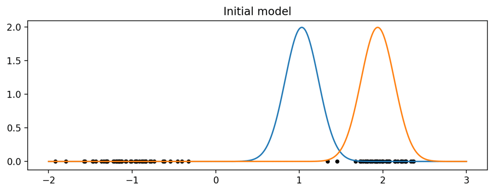
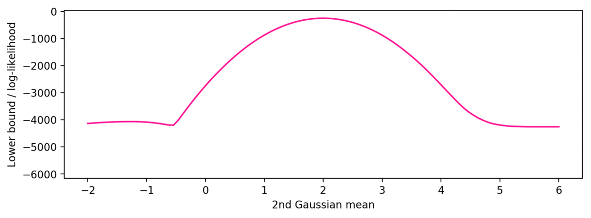
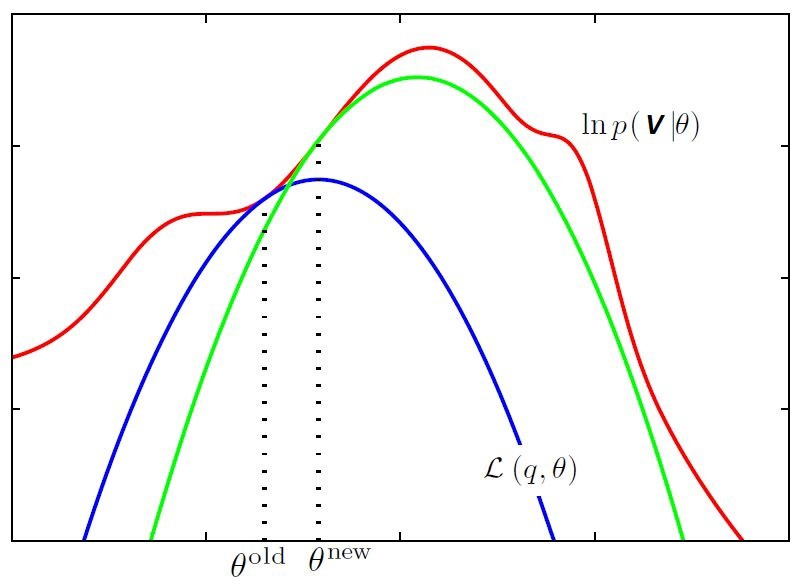

# Visualizing EM
This repo contains code for visualization of EM updates using Gaussian Mixture Model. You can also read a tutorial here - https://arazd.github.io/blog/2019/10/26/Visualizing-EM-lower-bound

The points assignment (E-step) and model updates (M-step): 
 

Data log-likelihood, lower bound function and parameter u2 update:
 

## Expectation-Maximization algorithm
Expectation-Maximization is an iterative method that performs clustering. EM maximizes data likelihood by updating current model’s parameters with a sequence of E and M steps. What happens during E-steps and M-steps?

*From practical perspective*:

* E-step: measure “how much” every data point belongs to each of the clusters, assign a responsibility vector based on that.
* M-step: update parameters of the clusters using the distribution of points that belong to it.

*From theoretical perspective*:

* E-step: construct a lower bound estimate for data log-likelihood.
* M-step: update parameters of the clusters so that we reach maximum of the lower bound estimate.

## Visualization
When it comes to maximizing the lower bound of EM algorithm, many resources show the following illustration (originally taken from C. Bishop):

 

This picture gives a great intuition about how EM updates maximize data log-likelihood in theory, and in this tutorial I want to show you how to code such visualization for some data.

This repository contains:
* EM_tutorial.ipynb - a step-by-step guide to understand EM through GMM example
* EM_utils.py - a python library for EM updates / visualization (< 100 lines of code)
* using_EM_utils.ipynb - an example of using EM_utils.py

